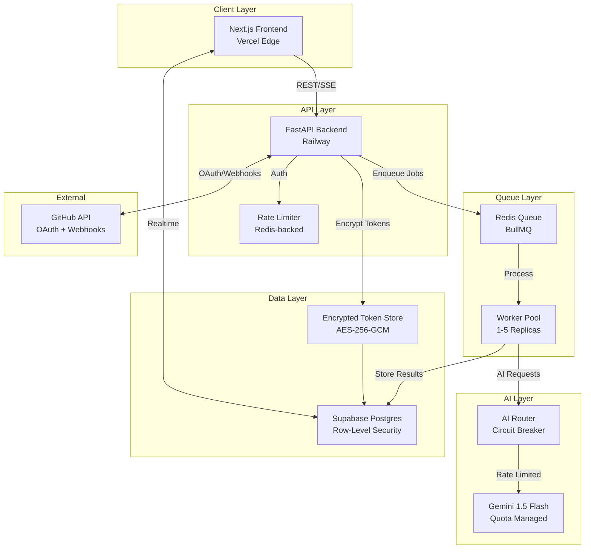
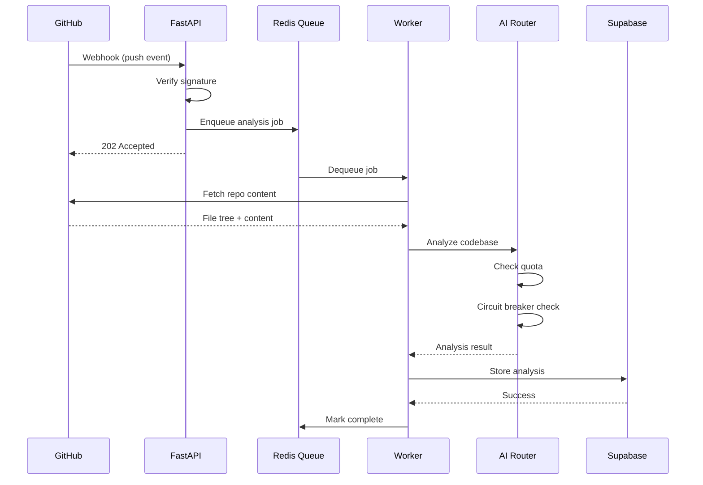
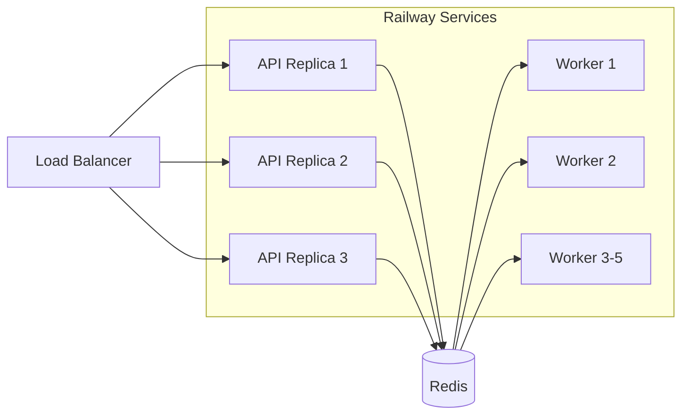
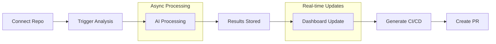

# AutoDevOps AI Platform

**Production-Grade AI-Powered DevOps Automation Platform**

[](https://fastapi.tiangolo.com/)
[](https://nextjs.org/)
[](https://supabase.com/)
[](https://redis.io/)
[](https://ai.google.dev/)
[](LICENSE)

---

## 10-Second System Snapshot

**AutoDevOps AI Platform** is a multi-tenant SaaS that connects to GitHub repositories, analyzes codebases using AI, and generates production-ready CI/CD configurations. Built with a distributed systems architecture featuring async job processing, circuit breaker patterns, and row-level security for tenant isolation.

| Layer | Technology | Purpose |
|-------|------------|---------|
| Frontend | Next.js 14 / Vercel | Server-rendered UI with real-time updates |
| API | FastAPI / Railway | Stateless REST API with OAuth2 |
| Queue | Redis / BullMQ | Async job processing with retries |
| AI | Gemini 1.5 Flash | Code analysis and CI generation |
| Database | Supabase Postgres | Multi-tenant storage with RLS |

---

## System Architecture



---

## Problem Statement

Enterprise DevOps teams managing 50+ repositories face three critical challenges:

1. **CI/CD Drift**: Pipeline configurations diverge from best practices, leading to deployment failures and security vulnerabilities
2. **Analysis Latency**: Manual code review processes cannot scale with repository growth
3. **Tool Fragmentation**: Disconnected tools for security scanning, performance analysis, and CI generation create operational overhead

**Engineering Impact**: Teams spend 40% of DevOps cycles on repetitive configuration tasks rather than building resilient deployment pipelines.

---

## Solution: Async AI Processing Pipeline

The platform implements an event-driven architecture that decouples repository analysis from AI inference:

### Request Flow

1. **GitHub Webhook** triggers on push/PR events
2. **API Gateway** validates signature, enqueues analysis job
3. **Worker Pool** pulls job, fetches repository content via GitHub API
4. **AI Router** routes to Gemini with quota checking and circuit breaker
5. **Result Storage** persists analysis with recommendations
6. **Real-time Update** pushed to frontend via Supabase Realtime



---

## Technology Decisions

| Component | Choice | Rationale | Trade-offs |
|-----------|--------|-----------|------------|
| **API Framework** | FastAPI | Async-first, type safety with Pydantic, OpenAPI generation | Smaller ecosystem vs Django |
| **Database** | Supabase Postgres | Managed Postgres with built-in Auth, RLS for multi-tenancy | Vendor lock-in vs self-hosted |
| **Queue** | Redis + BullMQ | Proven reliability, dead letter queues, delayed jobs | Additional infra dependency |
| **AI Provider** | Gemini 1.5 Flash | 1M token context, cost-effective for code analysis | Single provider dependency |
| **Hosting** | Railway + Vercel | Git-push deployments, automatic scaling, managed Redis | Higher cost vs bare metal |
| **Containerization** | Docker multi-stage | Reproducible builds, smaller attack surface | Build complexity |

---

## AI System Design

### Routing Architecture

The AI Router implements a multi-layer resilience pattern:

```
Request → Token Estimator → Quota Check → Circuit Breaker → Provider → Response
                ↓                  ↓              ↓
         Reject (>1M)      Reject (>limit)  Fallback/Retry
```

### Key Components

| Component | Implementation | Purpose |
|-----------|---------------|---------|
| **Token Estimator** | `app/ai/token_estimator.py` | Pre-validate context fits model window |
| **Quota Manager** | `app/ai/guard.py` | Per-user daily limits, org-level caps |
| **Circuit Breaker** | `app/ai/router.py` | Fail-fast on provider degradation |
| **Model Router** | `app/ai/model_router.py` | Route to optimal model by task type |

### Backend-Only AI Access

All AI operations execute server-side:
- No API keys exposed to frontend
- Rate limiting enforced per-user and per-IP
- Audit logging for all AI requests

```python
# app/ai/router.py - Circuit Breaker Pattern
class AIRouter:
    def __init__(self):
        self.circuit_state = "closed"
        self.failure_count = 0
        self.failure_threshold = 5
    
    async def analyze(self, content: str) -> AnalysisResult:
        if self.circuit_state == "open":
            raise AIServiceUnavailable("Circuit breaker open")
        
        try:
            result = await self.provider.analyze(content)
            self.failure_count = 0
            return result
        except Exception as e:
            self.failure_count += 1
            if self.failure_count >= self.failure_threshold:
                self.circuit_state = "open"
            raise
```

---

## Security Model

### Authentication & Authorization

| Layer | Mechanism | Implementation |
|-------|-----------|----------------|
| **User Auth** | GitHub OAuth2 | `app/routers/auth.py` |
| **Session** | JWT (HS256, 1hr expiry) | Stored in HttpOnly cookie |
| **Tenant Isolation** | Row-Level Security | Supabase RLS policies |
| **API Protection** | Rate Limiting | Redis-backed slowapi |

### Token Security

GitHub OAuth tokens are encrypted before storage:

```
OAuth Token → AES-256-GCM Encrypt → Base64 Encode → Database
                    ↓
            Key from ENCRYPTION_KEY env var (32 bytes)
```

**Implementation**: `app/services/encryption_service.py`

```python
# AES-256-GCM with random IV per encryption
def encrypt(self, plaintext: str) -> str:
    iv = os.urandom(12)  # GCM recommended IV size
    cipher = Cipher(algorithms.AES(self._key), modes.GCM(iv))
    encryptor = cipher.encryptor()
    ciphertext = encryptor.update(plaintext.encode()) + encryptor.finalize()
    return base64.urlsafe_b64encode(iv + ciphertext + encryptor.tag)
```

### Webhook Verification

All GitHub webhooks verified using HMAC-SHA256:

```python
# app/webhooks/verify.py
def verify_github_signature(payload: bytes, signature: str, secret: str) -> bool:
    expected = "sha256=" + hmac.new(
        secret.encode(), payload, hashlib.sha256
    ).hexdigest()
    return hmac.compare_digest(signature, expected)
```

### Secrets Management

| Secret | Storage | Rotation |
|--------|---------|----------|
| `SUPABASE_SERVICE_ROLE_KEY` | Railway env var | `scripts/rotate_supabase_key.sh` |
| `GEMINI_API_KEY` | Railway env var | `scripts/rotate_gemini_key.sh` |
| `ENCRYPTION_KEY` | Railway env var | Manual rotation with re-encryption |
| `GITHUB_CLIENT_SECRET` | Railway env var | GitHub OAuth settings |

---

## Scalability & Resilience

### Horizontal Scaling



| Service | Replicas | Scaling Trigger |
|---------|----------|-----------------|
| API | 1-3 | CPU > 70% |
| Workers | 1-5 | Queue depth > 100 |
| Cron | 1 | N/A (singleton) |

### Failure Modes & Mitigations

| Failure | Detection | Mitigation |
|---------|-----------|------------|
| Database connection | Health check `/health` | Connection pool retry, fail open |
| Redis unavailable | Queue ping | Graceful degradation, cached responses |
| AI provider down | Circuit breaker | Automatic retry with exponential backoff |
| Worker crash | Heartbeat timeout | Job re-queued, new worker picks up |

---

## Observability & Operations

### Logging

Structured JSON logging with correlation IDs:

```python
# app/logs/structured_logging.py
logger.info("Analysis completed", extra={
    "job_id": job_id,
    "repo_id": repo_id,
    "duration_ms": duration,
    "tokens_used": tokens
})
```

### Metrics Endpoints

| Endpoint | Purpose |
|----------|---------|
| `/health` | Liveness probe |
| `/ready` | Readiness probe (checks DB, Redis) |
| `/metrics` | Prometheus-compatible metrics |

### Alerting (Sentry + Custom)

- Error tracking via Sentry integration
- Custom alerts for queue backlog, AI latency, error rates
- Grafana dashboard for real-time monitoring

### Operational Runbook

See `ops/runbook.md` for:
- Deployment procedures
- Incident response playbooks
- Troubleshooting guides
- Secret rotation procedures

---

## Owner & Attribution

**Aditya Tiwari**  
Founder & Lead Engineer

- System architecture and design
- Backend API and worker implementation
- AI integration and routing logic
- Security model and encryption
- DevOps and deployment pipeline
- Documentation and operational practices

---

## Quick Start

### Prerequisites

- Python 3.11+
- Node.js 20+
- Docker & Docker Compose
- Supabase project
- GitHub OAuth App
- Google AI Studio API key

### Local Development

```bash
# 1. Clone repository
git clone https://github.com/adityat54544/AI-SAAS-1.git
cd AI-SAAS-1

# 2. Backend setup
python -m venv venv
source venv/bin/activate  # Windows: venv\Scripts\activate
pip install -r requirements.txt
cp .env.example .env
# Configure .env with your credentials

# 3. Frontend setup
cd frontend && npm install && cd ..

# 4. Start services
docker-compose up -d redis
uvicorn app.main:app --reload --port 8000
cd frontend && npm run dev
```

### Environment Variables

See `.env.example` for required configuration:

| Variable | Description | Required |
|----------|-------------|----------|
| `SUPABASE_URL` | Supabase project URL | Yes |
| `SUPABASE_SERVICE_ROLE_KEY` | Service role key | Yes |
| `GITHUB_CLIENT_ID` | GitHub OAuth client ID | Yes |
| `GITHUB_CLIENT_SECRET` | GitHub OAuth secret | Yes |
| `GEMINI_API_KEY` | Google AI API key | Yes |
| `ENCRYPTION_KEY` | 32-byte base64 key | Yes |

---

## Deployment

### Production Architecture

```
┌─────────────────────────────────────────────────────────────┐
│                      Production Stack                        │
├─────────────────────────────────────────────────────────────┤
│  Vercel (Frontend)                                          │
│  ├── Next.js 14 with App Router                             │
│  ├── Edge functions for auth                                │
│  └── Automatic HTTPS                                        │
├─────────────────────────────────────────────────────────────┤
│  Railway (Backend Services)                                 │
│  ├── autodevops-api (FastAPI)                               │
│  │   └── Replicas: 1-3, Health: /health                     │
│  ├── autodevops-worker (BullMQ)                             │
│  │   └── Replicas: 1-5, Queues: analysis, sync, ci_gen      │
│  ├── autodevops-cron (Scheduler)                            │
│  │   └── Jobs: backup, cleanup                              │
│  └── Redis (Plugin)                                         │
│      └── Queue management, Rate limiting, Caching           │
├─────────────────────────────────────────────────────────────┤
│  Supabase (Data Layer)                                      │
│  ├── PostgreSQL with Row-Level Security                     │
│  ├── Realtime subscriptions                                 │
│  └── Automated backups                                      │
└─────────────────────────────────────────────────────────────┘
```

### Deployment Commands

```bash
# Railway CLI deployment
railway login
railway link  # Link to existing project
railway up --service autodevops-api
railway up --service autodevops-worker
railway up --service autodevops-cron

# Vercel deployment
vercel --prod
```

---

## Single-Branch Workflow / Trunk-Based Development

This repository enforces a **trunk-based development** model where `main` is the only permanent branch and the sole source of truth for deployments.

### Engineering Rationale

| Principle | Benefit |
|-----------|---------|
| **Single Source of Truth** | Eliminates merge complexity and integration hell |
| **Continuous Integration** | All changes tested together, reducing integration risks |
| **Faster Feedback Loop** | Immediate CI/CD feedback on every merge |
| **Reduced Branch Sprawl** | No stale branches, no confusion about deployment state |
| **Simplified Deployment** | One branch to deploy, one pipeline to maintain |

### Workflow Model

```
┌─────────────────────────────────────────────────────────────┐
│              Trunk-Based Development Workflow               │
├─────────────────────────────────────────────────────────────┤
│                                                             │
│  main ───────────────────────────────────────────────●────▶ │
│         ↑              ↑              ↑                     │
│         │              │              │                     │
│    feature/a      fix/b         refactor/c                 │
│    (2 days)       (1 day)        (3 days)                  │
│         │              │              │                     │
│         └──────────────┴──────────────┘                     │
│                   │                                         │
│            PR + CI/CD + Review                              │
│                   │                                         │
│              Merge & Delete                                 │
│                                                             │
└─────────────────────────────────────────────────────────────┘
```

### Key Rules

1. **`main` is Protected**: No direct pushes, force pushes, or deletions
2. **All Changes via PR**: Every change requires a pull request with CI passing
3. **Short-Lived Branches**: Feature branches exist for < 3 days maximum
4. **Immediate Cleanup**: Branches deleted immediately after merge
5. **Deployment Source**: Only `main` triggers production deployments

### Branch Lifecycle

```bash
# 1. Create short-lived branch
git checkout -b feature/my-feature main

# 2. Make focused changes
git add . && git commit -m "feat: add new feature"

# 3. Push and open PR
git push origin feature/my-feature

# 4. After CI passes and approval, merge via GitHub UI

# 5. Branch auto-deletes after merge (enable in GitHub settings)
```

### Forbidden Patterns

- ❌ Long-lived feature branches (> 3 days)
- ❌ `develop`, `staging`, or `release/*` branches
- ❌ Direct commits to `main`
- ❌ Force pushes to `main`
- ❌ Merging without passing CI

### Detailed Documentation

See [`docs/branch_strategy.md`](docs/branch_strategy.md) for complete workflow guidelines, branch naming conventions, and emergency procedures.

---

## Feature Lifecycle



1. **Repository Connection**: OAuth flow → Token encrypted → Webhook registered
2. **Analysis Trigger**: Manual or webhook → Job enqueued → Worker processes
3. **AI Processing**: Code fetch → Token estimation → Gemini analysis → Results parsed
4. **CI/CD Generation**: Template selection → AI customization → PR creation

---

## Roadmap

### Completed

- [x] Multi-tenant architecture with RLS
- [x] GitHub OAuth and webhook integration
- [x] AI-powered repository analysis
- [x] CI/CD configuration generation
- [x] Real-time updates via Supabase
- [x] Circuit breaker and quota management

### In Progress

- [ ] Multi-model AI routing (Claude, GPT-4)
- [ ] Advanced security scanning
- [ ] Custom CI/CD templates

### Planned

- [ ] Self-hosted deployment option
- [ ] GitLab/Bitbucket support
- [ ] Team collaboration features

---

## Engineering Highlights

| Area | Implementation |
|------|----------------|
| **Async Processing** | BullMQ with dead letter queues, exponential backoff |
| **Security** | AES-256-GCM encryption, HMAC webhook verification, RLS |
| **Resilience** | Circuit breaker, health probes, graceful degradation |
| **Observability** | Structured logging, Sentry, Prometheus metrics |
| **Operations** | Runbook, backup scripts, secret rotation |
| **Testing** | Pytest with fixtures, E2E job flow tests |

---

## Documentation Index

| Document | Purpose |
|----------|---------|
| `docs/staff-overview.md` | Staff-engineer system narrative |
| `docs/architecture.md` | Detailed architecture diagrams |
| `ops/runbook.md` | Operational procedures |
| `ops/verification.md` | Deployment verification |
| `deploy/railway.md` | Railway deployment guide |
| `security/report.md` | Security assessment |

---

## License

MIT License - See [LICENSE](LICENSE) for details.