# AutoDevOps AI Platform - Architecture Documentation

**Author:** Aditya Tiwari, Founder & Lead Engineer  
**Last Updated:** February 2026

---

## Table of Contents

1. [High-Level Architecture](#high-level-architecture)
2. [Component Overview](#component-overview)
3. [Async Job Lifecycle](#async-job-lifecycle)
4. [Deployment Topology](#deployment-topology)
5. [Data Flow Diagrams](#data-flow-diagrams)
6. [Security Architecture](#security-architecture)
7. [Scaling Architecture](#scaling-architecture)

---

## High-Level Architecture

The system follows a layered, event-driven architecture designed for scalability and resilience.

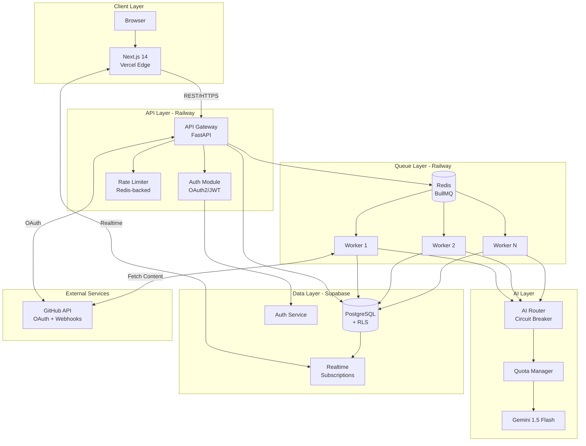

---

## Component Overview

### Frontend (Next.js 14 / Vercel)

| Component | Technology | Purpose |
|-----------|------------|---------|
| Pages | App Router (RSC) | Server-rendered UI |
| State | React Query + Zustand | Client state management |
| Realtime | Supabase Realtime | Live job updates |
| Auth | Supabase Auth | Session management |

### API (FastAPI / Railway)

| Endpoint Group | Purpose | Rate Limit |
|----------------|---------|------------|
| `/auth/*` | OAuth flow, session management | 20/min |
| `/repositories/*` | GitHub repo management | 30/min |
| `/analysis/*` | Trigger and fetch analyses | 10/min |
| `/jobs/*` | Job status and logs | 20/min |
| `/webhooks/*` | GitHub webhooks | 100/min |

### Workers (BullMQ / Railway)

| Queue | Purpose | Concurrency | Timeout |
|-------|---------|-------------|---------|
| `analysis` | Repository analysis | 5 | 5 min |
| `sync` | Repository sync | 3 | 2 min |
| `ci_generation` | CI/CD config generation | 3 | 3 min |

### Data Layer (Supabase)

| Table | Purpose | RLS |
|-------|---------|-----|
| `users` | User profiles | Yes |
| `organizations` | Tenant accounts | Yes |
| `repositories` | Connected repos | Yes |
| `analyses` | Analysis results | Yes |
| `jobs` | Job records | Yes |
| `github_tokens` | Encrypted OAuth tokens | Yes |

---

## Async Job Lifecycle

### Complete Job Flow

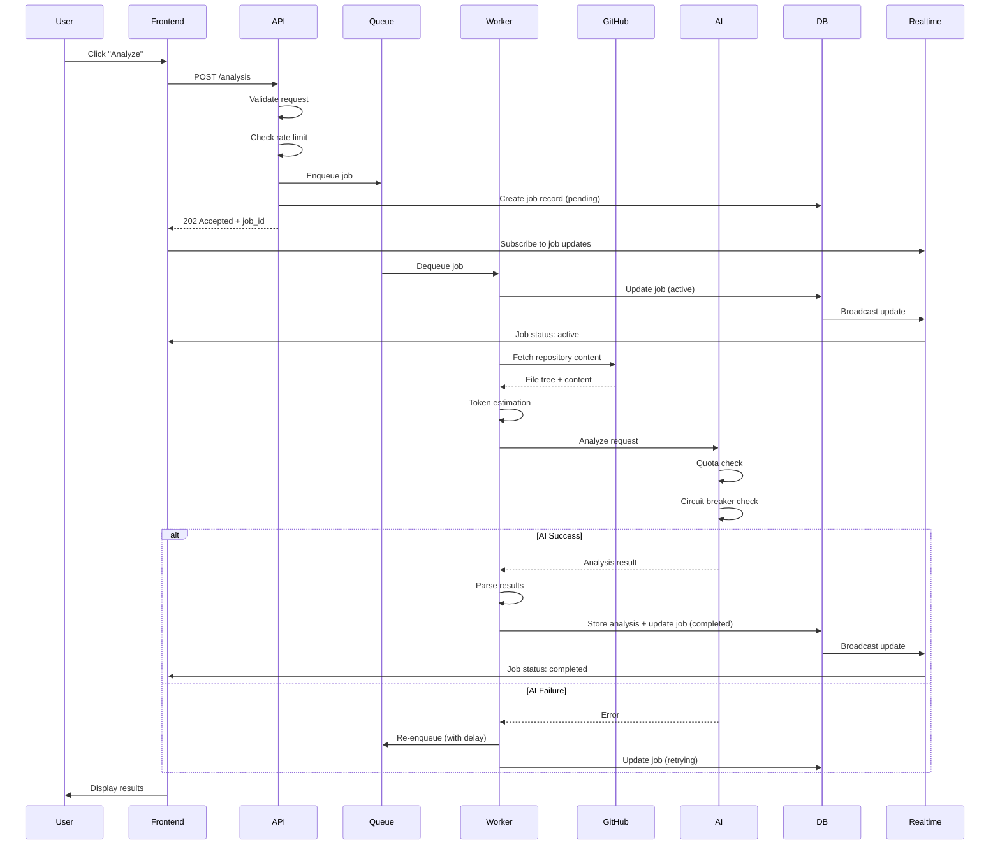

### Job State Machine

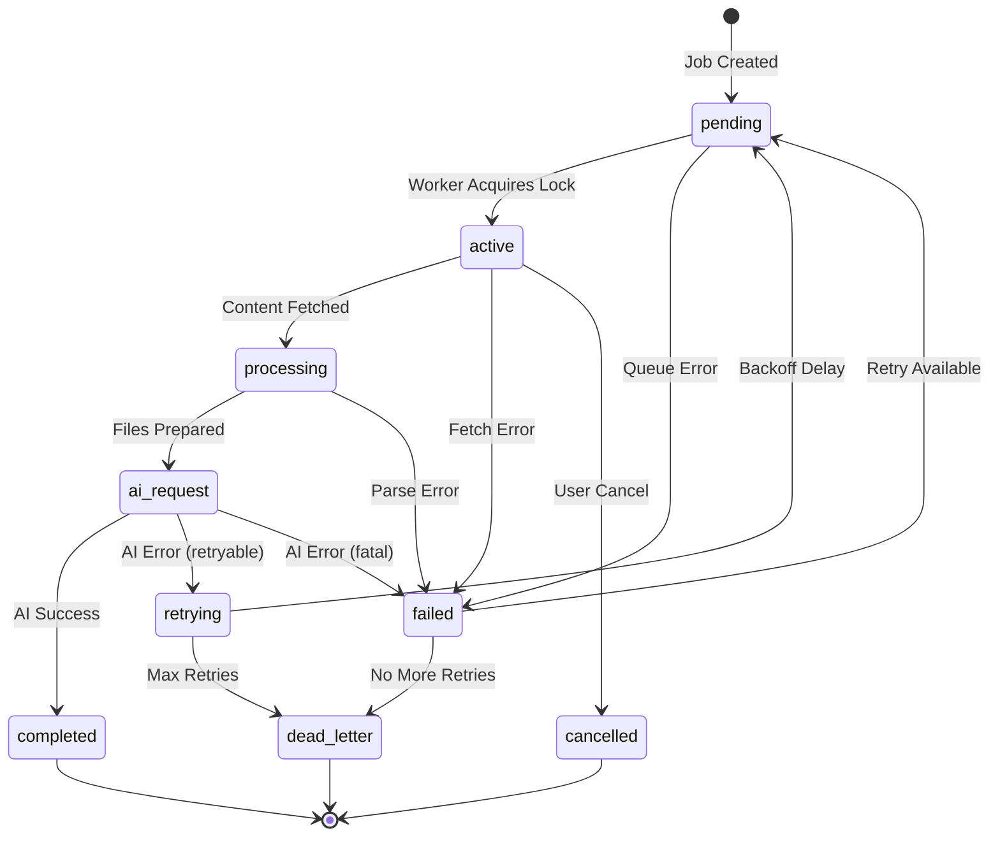

### Retry Configuration

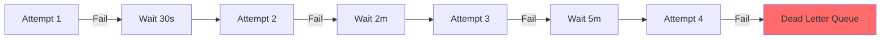

---

## Deployment Topology

### Production Environment

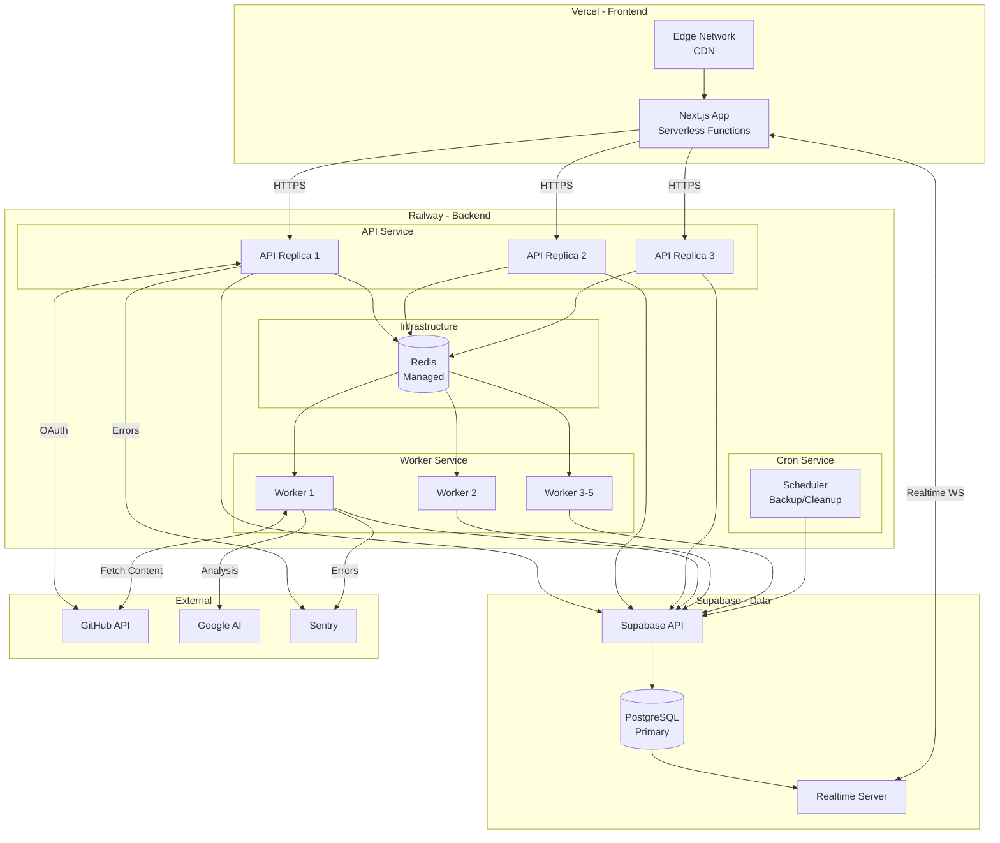

### Railway Service Configuration

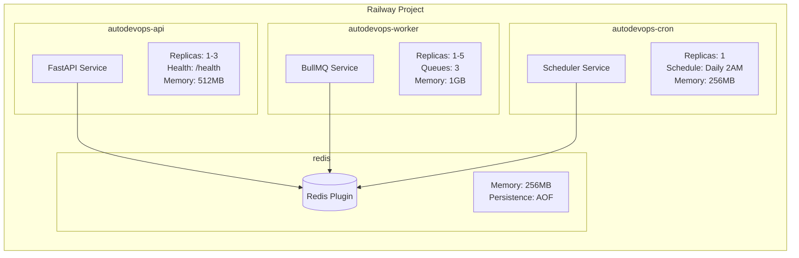

### Container Architecture

```mermaid
flowchart TB
    subgraph "Dockerfile.api"
        API_Base[python:3.11-slim]
        API_Deps[Install Dependencies]
        API_App[Copy Application]
        API_Run[uvicorn app.main:app]
    end
    
    subgraph "Dockerfile.worker"
        Worker_Base[node:20-alpine]
        Worker_Deps[npm install]
        Worker_App[Copy Workers]
        Worker_Run[node dist/index.js]
    end
    
    subgraph "Dockerfile.cron"
        Cron_Base[python:3.11-slim]
        Cron_Deps[Install Dependencies]
        Cron_Scripts[Copy Scripts]
        Cron_Run[cron + backup_pg.sh]
    end
    
    API_Base --> API_Deps --> API_App --> API_Run
    Worker_Base --> Worker_Deps --> Worker_App --> Worker_Run
    Cron_Base --> Cron_Deps --> Cron_Scripts --> Cron_Run
```

---

## Data Flow Diagrams

### Authentication Flow

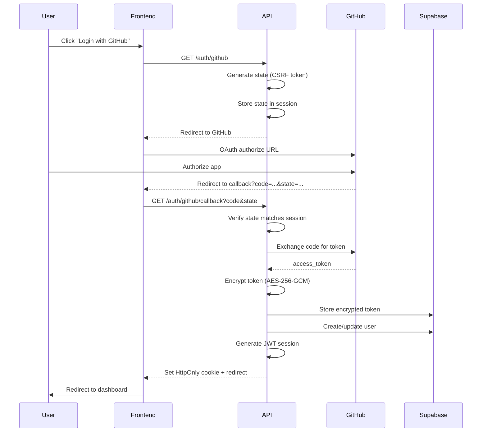

### Webhook Processing Flow

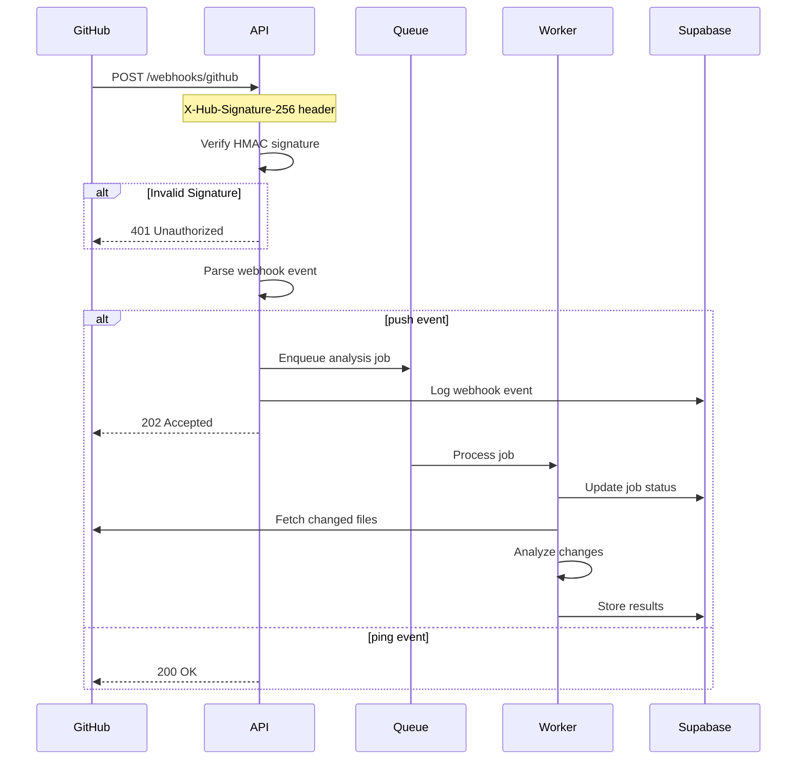

### AI Request Flow

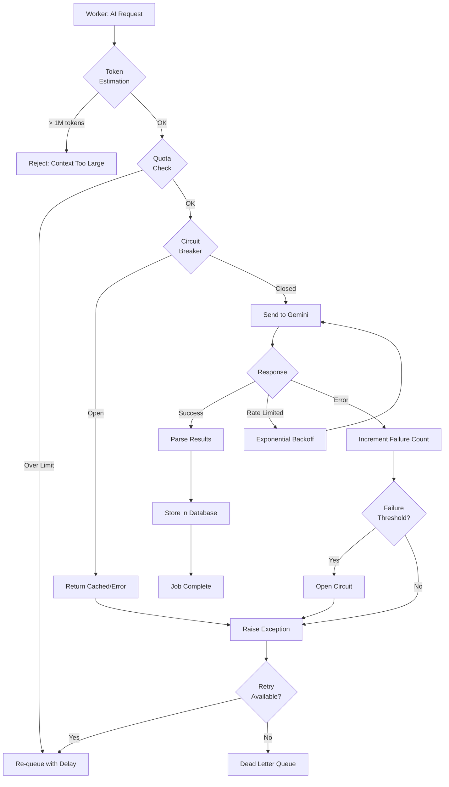

---

## Security Architecture

### Multi-Layer Security Model

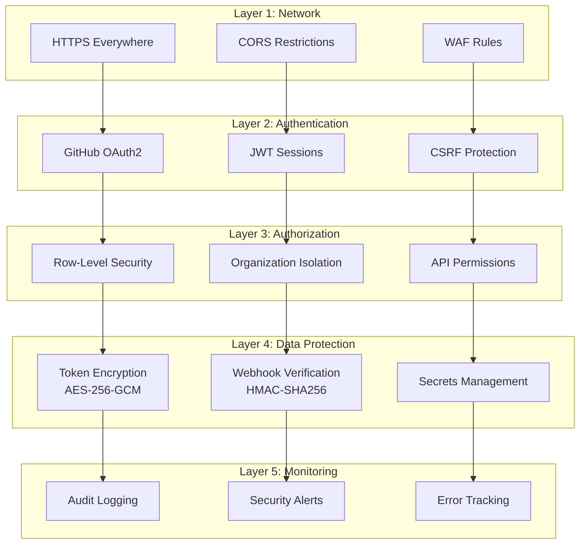

### Row-Level Security Implementation

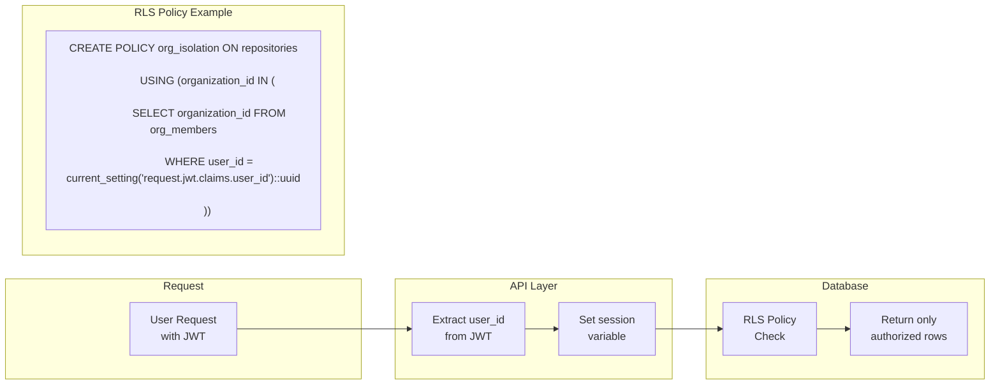

---

## Scaling Architecture

### Horizontal Scaling Strategy

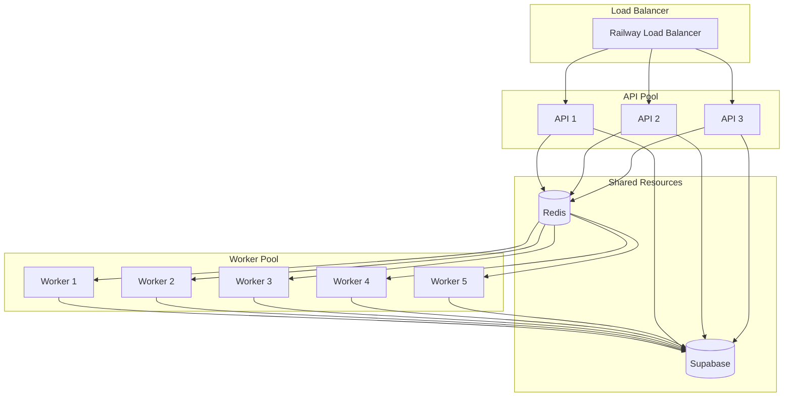

### Auto-Scaling Triggers

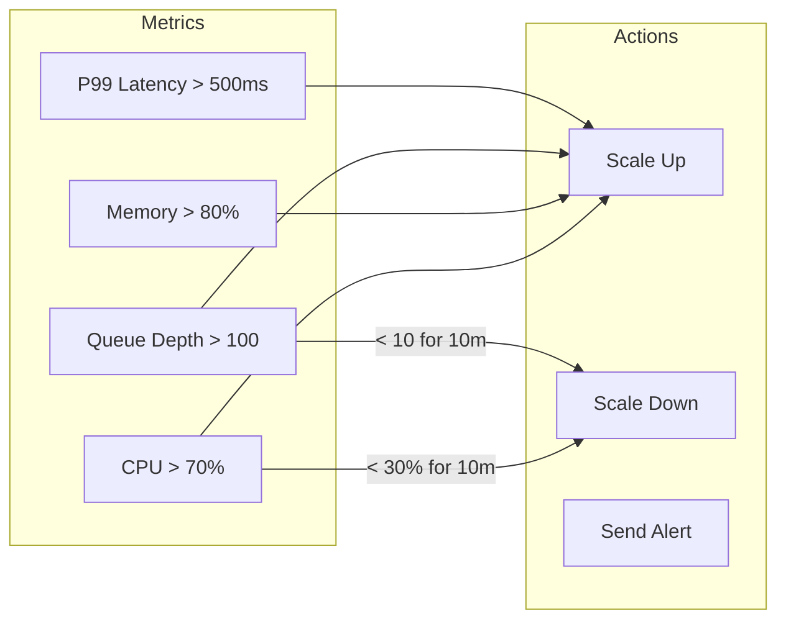

### Database Connection Pooling

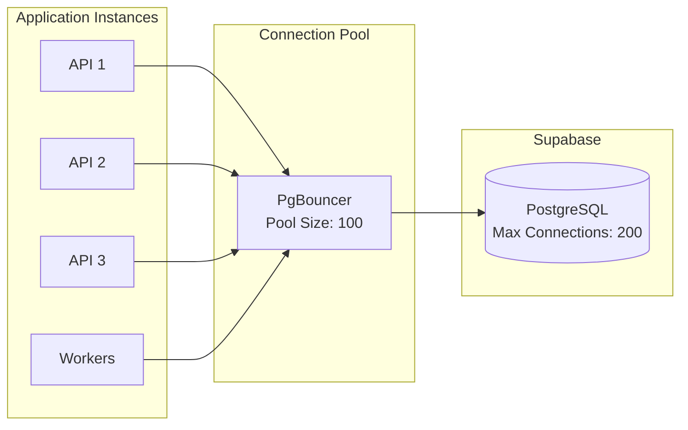

---

## Summary

This architecture documentation covers the complete system design from high-level components to detailed data flows. Key architectural decisions include:

1. **Event-Driven Processing**: Async job queues for long-running AI operations
2. **Defense-in-Depth Security**: Multiple layers from network to data protection
3. **Horizontal Scalability**: Stateless services with shared Redis/Postgres
4. **Resilience Patterns**: Circuit breakers, retries with backoff, dead letter queues
5. **Observable Operations**: Structured logging, health probes, real-time monitoring

For operational procedures, see [../ops/runbook.md](../ops/runbook.md).  
For architectural decisions rationale, see [staff-overview.md](./staff-overview.md).