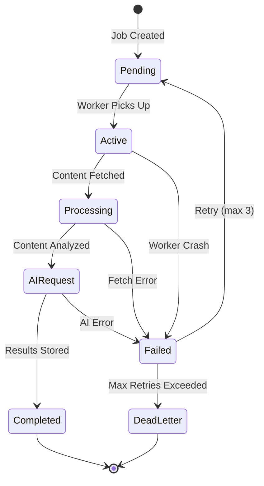
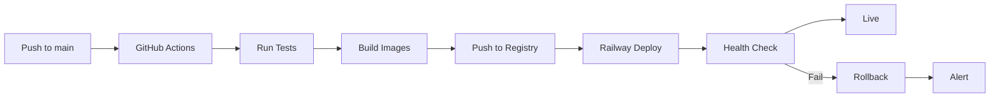

# AutoDevOps AI Platform - Staff Engineering Overview

**Author:** Aditya Tiwari, Founder & Lead Engineer  
**Last Updated:** February 2026

---

## Executive Summary

The AutoDevOps AI Platform is a production-grade, multi-tenant SaaS system designed to automate repository analysis and CI/CD pipeline generation. This document provides a staff-engineer-level narrative explaining the architectural decisions, trade-offs, and operational considerations that shaped the system.

---

## System Design Philosophy

### Core Principles

1. **Security-First Architecture**: Every design decision prioritizes security, from encrypted token storage to row-level isolation
2. **Async-First Processing**: Long-running AI operations are decoupled from request handlers via job queues
3. **Fail-Safe Defaults**: Circuit breakers, rate limits, and graceful degradation are built into core components
4. **Observable Operations**: Structured logging, metrics, and health probes enable rapid incident response

### Architectural Pattern

The system implements a **Layered Event-Driven Architecture**:

```
┌─────────────────────────────────────────────────────────────────┐
│                    PRESENTATION LAYER                           │
│  Next.js 14 (Server Components) + React Query + Supabase RT    │
├─────────────────────────────────────────────────────────────────┤
│                      API LAYER                                  │
│  FastAPI + OAuth2 + Rate Limiting + Input Validation           │
├─────────────────────────────────────────────────────────────────┤
│                    SERVICE LAYER                                │
│  Business Logic + Encryption + GitHub Integration              │
├─────────────────────────────────────────────────────────────────┤
│                    QUEUE LAYER                                  │
│  Redis + BullMQ + Dead Letter Queues + Retries                 │
├─────────────────────────────────────────────────────────────────┤
│                      AI LAYER                                   │
│  Router + Circuit Breaker + Quota Manager + Gemini Provider    │
├─────────────────────────────────────────────────────────────────┤
│                     DATA LAYER                                  │
│  Supabase PostgreSQL + Row-Level Security + Realtime           │
└─────────────────────────────────────────────────────────────────┘
```

---

## Key Architectural Decisions

### 1. Why FastAPI Over Django/Flask

**Decision:** FastAPI with async/await throughout the stack

**Rationale:**
- Native async support critical for AI operations (100ms-30s latency)
- Pydantic integration provides runtime type validation
- Automatic OpenAPI documentation reduces API maintenance
- Performance: ~2x throughput vs Flask for I/O-bound workloads

**Trade-offs:**
- Smaller ecosystem vs Django (no built-in admin, ORM less mature)
- Requires more explicit error handling
- Team familiarity curve for async patterns

**Alternatives Considered:**
- Django + async: Heavier footprint, async support less mature
- Flask + gevent: Less structured, debugging complexity
- Node.js/Express: Would require separate codebase from workers

### 2. Why Supabase Over Self-Hosted Postgres

**Decision:** Supabase managed PostgreSQL with Row-Level Security

**Rationale:**
- RLS provides defense-in-depth for multi-tenancy (data isolation at database level)
- Built-in authentication reduces integration complexity
- Realtime subscriptions eliminate need for separate WebSocket infrastructure
- Managed backups and point-in-time recovery

**Trade-offs:**
- Vendor lock-in (Supabase client SDK coupling)
- Cost at scale vs self-hosted
- Limited control over Postgres configuration

**Implementation Detail:**

```sql
-- Row-Level Security Policy Example
CREATE POLICY "Users can only see their organization's repositories"
ON repositories FOR SELECT
USING (organization_id IN (
    SELECT organization_id FROM organization_members
    WHERE user_id = auth.uid()
));
```

### 3. Why Redis/BullMQ Over Celery/RabbitMQ

**Decision:** Redis with BullMQ (TypeScript workers)

**Rationale:**
- Single infrastructure dependency (Redis serves queue + cache + rate limiting)
- BullMQ provides native TypeScript support matching frontend stack
- Dead letter queues and delayed jobs out of the box
- Lower operational complexity vs RabbitMQ

**Trade-offs:**
- Redis persistence model (AOF/RDB) less robust than RabbitMQ
- No built-in message routing patterns
- Memory-bound queue size

**Queue Design:**

```
┌──────────────┐     ┌──────────────┐     ┌──────────────┐
│   analysis   │     │    sync      │     │ ci_generation│
│    queue     │     │    queue     │     │    queue     │
├──────────────┤     ├──────────────┤     ├──────────────┤
│ Priority: 1  │     │ Priority: 2  │     │ Priority: 3  │
│ Timeout: 5m  │     │ Timeout: 2m  │     │ Timeout: 3m  │
│ Retries: 3   │     │ Retries: 5   │     │ Retries: 2   │
└──────────────┘     └──────────────┘     └──────────────┘
         │                   │                    │
         └───────────────────┼────────────────────┘
                             ▼
                    ┌──────────────┐
                    │  Dead Letter │
                    │    Queue     │
                    └──────────────┘
```

### 4. Why Gemini 1.5 Flash Over GPT-4/Claude

**Decision:** Google Gemini 1.5 Flash as primary AI provider

**Rationale:**
- 1M token context window enables whole-repository analysis
- Cost: ~10x cheaper than GPT-4 for equivalent tokens
- Flash variant optimized for latency-sensitive applications
- Native code understanding capabilities

**Trade-offs:**
- Single provider dependency (mitigated with router abstraction)
- Less established track record vs OpenAI
- Rate limits more aggressive

**Cost Analysis (per 1000 analyses):**

| Provider | Input Cost | Output Cost | Total (avg) |
|----------|-----------|-------------|-------------|
| Gemini 1.5 Flash | $0.075/1M tokens | $0.30/1M tokens | ~$25 |
| GPT-4 Turbo | $10/1M tokens | $30/1M tokens | ~$500 |
| Claude 3 Sonnet | $3/1M tokens | $15/1M tokens | ~$180 |

### 5. Why Railway + Vercel Over AWS/GCP

**Decision:** Railway (backend) + Vercel (frontend)

**Rationale:**
- Git-push deployments reduce CI/CD complexity
- Automatic SSL, preview deployments, rollbacks
- Managed Redis removes infrastructure burden
- Cost predictable for current scale

**Trade-offs:**
- Less control over infrastructure
- Potential cold start latency
- Vendor lock-in for deployment pipelines

---

## Security Architecture Deep Dive

### Defense in Depth

The system implements security at multiple layers:

```
┌─────────────────────────────────────────────────────────────────┐
│ Layer 1: Network Security                                       │
│ - HTTPS everywhere (Vercel/Railway managed)                    │
│ - CORS restrictions                                             │
│ - Rate limiting (per-user and per-IP)                          │
├─────────────────────────────────────────────────────────────────┤
│ Layer 2: Authentication                                         │
│ - GitHub OAuth2 with PKCE                                       │
│ - JWT sessions with short expiry (1hr)                          │
│ - HttpOnly, Secure cookies                                      │
├─────────────────────────────────────────────────────────────────┤
│ Layer 3: Authorization                                          │
│ - Row-Level Security in database                                │
│ - Organization-based tenant isolation                           │
│ - API endpoint permission checks                                │
├─────────────────────────────────────────────────────────────────┤
│ Layer 4: Data Protection                                        │
│ - AES-256-GCM encryption for OAuth tokens                       │
│ - HMAC-SHA256 webhook verification                              │
│ - Secrets via environment variables only                         │
├─────────────────────────────────────────────────────────────────┤
│ Layer 5: Audit & Monitoring                                     │
│ - Structured logging with correlation IDs                       │
│ - Sentry error tracking                                         │
│ - GitHub audit log integration                                  │
└─────────────────────────────────────────────────────────────────┘
```

### Token Encryption Flow

```
GitHub OAuth Token
        │
        ▼
┌───────────────────┐
│ EncryptionService │
│ AES-256-GCM       │
│ Random IV (12B)   │
└───────────────────┘
        │
        ▼
Base64(IV || Ciphertext || Tag)
        │
        ▼
┌───────────────────┐
│   Supabase DB     │
│ github_tokens     │
│ (encrypted_token) │
└───────────────────┘
```

### Webhook Security

Every webhook from GitHub is verified:

1. Extract `X-Hub-Signature-256` header
2. Compute HMAC-SHA256 of raw payload with webhook secret
3. Constant-time comparison to prevent timing attacks
4. Reject if mismatch (401 Unauthorized)

---

## Async Job Lifecycle

The complete lifecycle of an analysis job:



### Job States

| State | Description | Next States |
|-------|-------------|-------------|
| `pending` | Job enqueued, waiting for worker | `active`, `failed` |
| `active` | Worker processing | `completed`, `failed` |
| `completed` | Results stored successfully | Terminal |
| `failed` | Error occurred, will retry | `pending`, `dead_letter` |
| `dead_letter` | Max retries exceeded | Terminal |

### Retry Strategy

```
Attempt 1: Immediate
Attempt 2: 30s delay
Attempt 3: 2m delay
Attempt 4: Move to dead letter queue
```

Exponential backoff with jitter to prevent thundering herd.

---

## Operational Practices

### Deployment Pipeline



### Health Check Strategy

| Endpoint | Check | Timeout |
|----------|-------|---------|
| `/health` | Process alive | 5s |
| `/ready` | DB + Redis connected | 10s |
| `/metrics` | Prometheus scrape | 30s |

### Secret Rotation

Implemented scripts for non-disruptive key rotation:

1. **Gemini API Key**: `scripts/rotate_gemini_key.sh`
   - Generates new key in Google AI Studio
   - Updates Railway environment variable
   - Restarts API and worker services
   - Validates with test request

2. **Supabase Keys**: `scripts/rotate_supabase_key.sh`
   - Creates new service role key
   - Updates environment variable
   - Maintains old key until all services restarted

---

## Scaling Considerations

### Current Bottlenecks

| Component | Limit | Mitigation |
|-----------|-------|------------|
| API replicas | 3 max (Railway) | Horizontal scaling |
| Workers | 5 max (Railway) | Queue-based backpressure |
| Gemini rate limit | 60 req/min | Quota manager + caching |
| Supabase connections | 100 pool | Connection pooling |

### Scaling Path

When approaching limits:

1. **API Layer**: Add replicas, implement request coalescing
2. **Worker Layer**: Increase replicas, prioritize queues
3. **AI Layer**: Implement request caching, batch processing
4. **Database**: Upgrade Supabase tier, implement read replicas

---

## Lessons Learned

### What Worked Well

1. **Async-first design** prevented request pile-up during AI latency spikes
2. **Circuit breaker** prevented cascade failures during Gemini outages
3. **RLS for multi-tenancy** eliminated entire class of data leak vulnerabilities
4. **Structured logging** enabled rapid debugging in production

### What Would Change

1. **Earlier circuit breaker implementation** - First Gemini outage caused 15min of failed requests
2. **More aggressive caching** - Repeated analyses of same repos waste AI tokens
3. **Better test coverage for workers** - E2E tests caught issues unit tests missed
4. **Earlier adoption of pre-commit hooks** - Caught linting issues too late in CI

---

## Future Architecture Evolution

### Short-term (3 months)

- Multi-model AI routing (Claude, GPT-4 as fallbacks)
- Request caching layer (Redis)
- Background job priorities per tier

### Medium-term (6 months)

- Self-hosted deployment option
- GitLab/Bitbucket support
- Team collaboration features

### Long-term (12 months)

- Hybrid cloud deployment
- Custom model fine-tuning
- Enterprise SSO integration

---

## Conclusion

The AutoDevOps AI Platform demonstrates production-grade engineering across security, scalability, and operational excellence. The architecture prioritizes reliability and maintainability while enabling rapid feature development. Key differentiators include:

- **Security-by-design**: Encryption at rest, RLS, webhook verification
- **Resilience patterns**: Circuit breakers, retries with backoff, health probes
- **Operational maturity**: Runbooks, secret rotation, structured observability

This system represents a solid foundation for enterprise adoption while maintaining development velocity.

---

*For detailed architecture diagrams, see [architecture.md](./architecture.md)*  
*For operational procedures, see [../ops/runbook.md](../ops/runbook.md)*