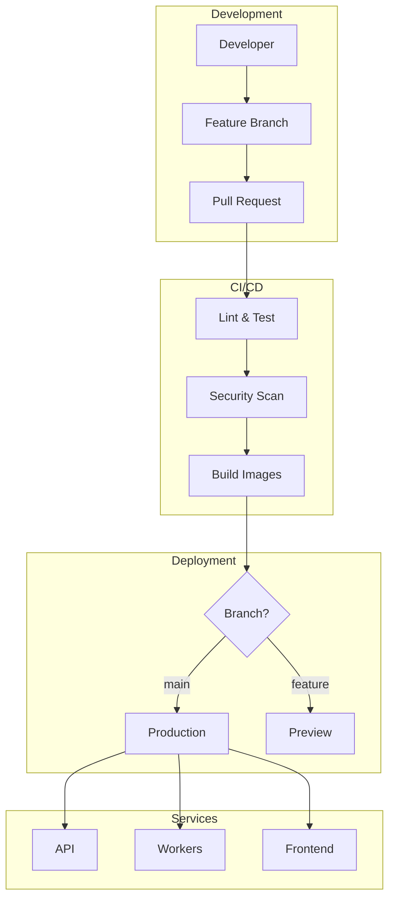

# Staff-Engineer Repository Structure Guide

**AutoDevOps AI Platform**  
**Author:** Aditya Tiwari  
**Last Updated:** 2026-02-20

---

## Purpose

This document prescribes the repository structure and practices expected for internal-company systems at staff-engineer maturity level. It serves as a reference for current and future team members to understand how the repository is organized and why specific patterns were chosen.

---

## Mono-Repo vs Multi-Repo Trade-offs

### Decision: Mono-Repo for Current Scale

We chose a **mono-repo** structure where backend, frontend, workers, and infrastructure live in a single repository.

| Factor | Mono-Repo | Multi-Repo |
|--------|-----------|------------|
| **Code Sharing** | ✅ Easy shared utilities | ❌ Package publishing required |
| **Refactoring** | ✅ Atomic cross-service changes | ❌ Coordinated releases |
| **CI/CD** | ✅ Single pipeline | ❌ Pipeline per repo |
| **Discovery** | ✅ All code visible | ❌ Requires documentation |
| **Build Time** | ⚠️ May be slower | ✅ Isolated builds |
| **Access Control** | ⚠️ All or nothing | ✅ Granular permissions |
| **Team Autonomy** | ⚠️ Coordinated changes | ✅ Independent releases |

**Recommendation:** Mono-repo for teams < 20 engineers. Consider splitting when:
- Build times exceed 30 minutes
- Different release cadences required
- Security boundaries require isolation

---

## Repository Top-Level Folders

### Standard Structure

```
/
├── app/                    # Backend application
├── frontend/               # Frontend application
├── workers/                # Background job processors
├── infra/                  # Infrastructure as Code
├── docs/                   # Documentation
├── scripts/                # Utility scripts
├── tests/                  # Test suites
├── deploy/                 # Deployment guides
├── ops/                    # Operational runbooks
├── security/               # Security documentation
├── supabase/               # Database migrations
├── grafana/                # Monitoring dashboards
├── ci/                     # CI outputs
├── repo/                   # Repository governance
└── .github/                # GitHub configuration
```

### Folder Purposes

| Folder | Purpose | Contents |
|--------|---------|----------|
| `/app` | Backend API | FastAPI application, business logic, API routes |
| `/frontend` | Web UI | Next.js application, React components |
| `/workers` | Async processing | BullMQ processors, queue definitions |
| `/infra` | Infrastructure | Terraform, Pulumi, or provider configs |
| `/docs` | Documentation | Architecture, ADRs, guides |
| `/scripts` | Utilities | Automation, deployment helpers |
| `/tests` | Test suites | Unit, integration, E2E tests |
| `/deploy` | Deployment docs | Provider-specific guides |
| `/ops` | Operations | Runbooks, incident procedures |
| `/security` | Security | Security policy, reports |
| `/supabase` | Database | Migrations, seed data |
| `/grafana` | Monitoring | Dashboard definitions |
| `/ci` | CI outputs | Build artifacts, reports |
| `/repo` | Governance | Branch audits, workflow docs |
| `/.github` | GitHub config | Workflows, templates, CODEOWNERS |

---

## Service Boundaries

### Current Architecture

```
┌─────────────────────────────────────────────────────────────────┐
│                        Service Architecture                      │
├─────────────────────────────────────────────────────────────────┤
│                                                                 │
│  ┌─────────────┐    ┌─────────────┐    ┌─────────────┐        │
│  │   Frontend  │    │    API      │    │   Workers   │        │
│  │  (Next.js)  │───▶│  (FastAPI)  │───▶│  (BullMQ)   │        │
│  │             │    │             │    │             │        │
│  │ Port: 3000  │    │ Port: 8000  │    │ Background  │        │
│  │ Vercel      │    │ Railway     │    │ Railway     │        │
│  └─────────────┘    └─────────────┘    └─────────────┘        │
│         │                  │                  │                │
│         │                  ▼                  │                │
│         │          ┌─────────────┐           │                │
│         │          │   Redis     │◀──────────┘                │
│         │          │  (Queue)    │                            │
│         │          └─────────────┘                            │
│         │                  │                                   │
│         │                  ▼                                   │
│         │          ┌─────────────┐                            │
│         └─────────▶│  Supabase   │                            │
│                    │ (PostgreSQL)│                            │
│                    └─────────────┘                            │
│                                                                 │
└─────────────────────────────────────────────────────────────────┘
```

### Service Responsibilities

| Service | Responsibility | Owner |
|---------|---------------|-------|
| Frontend | User interface, client-side logic | `frontend/` |
| API | Request handling, business logic | `app/` |
| Workers | Background processing, AI calls | `workers/` |
| Database | Data persistence, RLS | `supabase/` |
| Queue | Job management, caching | External (Redis) |

---

## Infrastructure as Code (IaC) Placement

### IaC Structure

```
/infra
├── railway/
│   ├── railway.toml          # Railway configuration
│   └── README.md             # Railway-specific docs
├── terraform/                # (Future) Terraform modules
│   ├── modules/
│   ├── environments/
│   │   ├── staging/
│   │   └── production/
│   └── main.tf
└── pulumi/                   # (Alternative) Pulumi programs
    ├── Pulumi.yaml
    └── index.ts
```

### IaC Best Practices

1. **Version Control Everything:** All infrastructure configs in repo
2. **Environment Parity:** Same configs for staging and production
3. **Secrets Management:** Never hardcode secrets in IaC
4. **State Management:** Use remote state (S3, Terraform Cloud)
5. **DRY:** Use modules for reusable components

---

## Docker & Kubernetes Manifests

### Docker Structure

```
/
├── Dockerfile              # Base image
├── Dockerfile.api          # API service
├── Dockerfile.worker       # Worker service
├── Dockerfile.cron         # Cron service
└── docker-compose.yml      # Local development
```

### Kubernetes (Future)

```
/k8s
├── base/
│   ├── deployment.yaml
│   ├── service.yaml
│   ├── configmap.yaml
│   └── kustomization.yaml
├── overlays/
│   ├── staging/
│   │   └── kustomization.yaml
│   └── production/
│       └── kustomization.yaml
└── README.md
```

---

## Environment & Secret Management

### Secret Storage Strategy

**Never store secrets in:**
- Source code
- Docker images
- Git history
- Environment files (`.env`)

**Do store secrets in:**
- Provider secret managers (Railway variables)
- External secret managers (HashiCorp Vault, AWS Secrets Manager)
- CI/CD secrets (GitHub Actions secrets)

### Environment Configuration

```
/.env.example              # Template with all required vars
/app/config.py             # Configuration loading
/scripts/rotate_*.sh       # Key rotation scripts
```

### Required Secrets

| Secret | Purpose | Rotation |
|--------|---------|----------|
| `SUPABASE_URL` | Database connection | Manual |
| `SUPABASE_SERVICE_ROLE_KEY` | Admin access | Quarterly |
| `GITHUB_CLIENT_ID` | OAuth | Manual |
| `GITHUB_CLIENT_SECRET` | OAuth | Quarterly |
| `GEMINI_API_KEY` | AI provider | Quarterly |
| `ENCRYPTION_KEY` | Token encryption | Annual |
| `RAILWAY_TOKEN` | Deployment | Manual |

---

## Release Branches Policy

### Policy: Short-Lived Only

**Allowed Branch Types:**
- `feature/*` - New features (< 3 days)
- `fix/*` - Bug fixes (< 1 day)
- `hotfix/*` - Critical fixes (< 1 day)
- `docs/*` - Documentation (< 1 day)
- `chore/*` - Maintenance (< 1 day)

**Forbidden:**
- `develop` branch
- `staging` branch
- `release/*` branches
- Long-lived feature branches

### Release Process

Releases are created via **tags**, not branches:

```bash
# Create release
git tag -a v1.2.0 -m "Release 1.2.0: Feature X"
git push origin v1.2.0

# Deployments track tags
# Railway deploys from tag in CI
```

---

## CODEOWNERS & Ownership Boundaries

### Ownership Model

```yaml
# .github/CODEOWNERS

# Default owner
* @adityat54544

# Domain-specific ownership (future expansion)
/app/ai/ @adityat54544       # AI domain
/app/routers/ @adityat54544  # API domain
/frontend/ @adityat54544     # Frontend domain
/workers/ @adityat54544      # Worker domain
```

### Ownership Principles

1. **Every file has an owner:** No orphaned code
2. **Owners review changes:** CODEOWNERS auto-requests review
3. **Ownership is documented:** Clear in MAINTAINERS.md
4. **Ownership can evolve:** Update as team grows

---

## API Versioning & SDK Publishing

### API Versioning Strategy

```
/api/v1/...     # Current stable API
/api/v2/...     # Next version (when needed)
```

**Versioning Rules:**
- URL path versioning (not headers)
- Maintain v1 for at least 6 months after v2 launch
- Deprecation notice in API response headers
- Document breaking changes in CHANGELOG

---

## CI Pipelines Per Service

### Pipeline Structure

```
.github/workflows/
├── ci.yml              # Main CI pipeline
├── commitlint.yml      # Commit message linting
└── monitoring_checks.yml # Metrics verification
```

### Per-Service Jobs

| Job | Services | Trigger |
|-----|----------|---------|
| security-scan | All | Always |
| backend-test | `app/` | Always |
| frontend-test | `frontend/` | Always |
| workers-test | `workers/` | Always |
| infra-lint | `infra/`, Dockerfiles | Always |
| integration-test | All | After unit tests |
| build | All | main branch |
| deploy | All | main branch + tag |

---

## Staging vs Production Deploy Flow

### Deployment Pipeline

```
Feature Branch
      │
      ▼
┌─────────┐    ┌─────────┐    ┌─────────┐
│  Lint   │───▶│  Test   │───▶│  Build  │
└─────────┘    └─────────┘    └─────────┘
      │
      ▼
Pull Request to main
      │
      ▼
┌─────────┐    ┌─────────┐    ┌─────────┐
│ Review  │───▶│  CI     │───▶│ Merge   │
└─────────┘    └─────────┘    └─────────┘
                     │
                     ▼
              ┌─────────────┐
              │ Production  │
              │ (main only) │
              └─────────────┘
```

### Environment Configuration

| Environment | Trigger | Branch | Purpose |
|-------------|---------|--------|---------|
| Preview | PR | feature/* | Testing changes |
| Production | Merge | main | Release |

---

## Tagging and Promotion

### Semantic Versioning Tags

```
v1.0.0        # Major release
v1.1.0        # Minor release
v1.1.1        # Patch release
v2.0.0-beta.1 # Pre-release
```

### Promotion Strategy

```
v1.2.0-rc.1   →  Testing
     ↓
v1.2.0        →  Production
```

---

## SLOs/SLIs & On-Call Routing

### Service Level Objectives

| Service | SLO | SLI |
|---------|-----|-----|
| API | 99.9% availability | Success rate |
| API | p95 latency < 500ms | Latency histogram |
| Workers | p95 processing < 5min | Job duration |
| AI | p95 response < 30s | AI call duration |

### On-Call Routing

```
Alert → PagerDuty/Opsgenie → On-Call Engineer
                                    │
                                    ▼
                            ops/oncall_playbook.md
```

---

## Runbooks & Incident Postmortems

### Runbook Location

```
/ops
├── runbook.md           # General operations
├── oncall_playbook.md   # Incident response
├── verification.md      # Deployment verification
└── auto-scaler.md       # Scaling procedures
```

### Postmortem Process

After every incident:

1. **Timeline:** Document what happened when
2. **Root Cause:** Identify underlying issue
3. **Impact:** Measure user/business impact
4. **Action Items:** Prevent recurrence
5. **Documentation:** Update runbooks

---

## Service Boundaries Diagram



---

## Quick Reference: File Locations

| What | Where |
|------|-------|
| API endpoints | `app/routers/` |
| Business logic | `app/services/` |
| AI integration | `app/ai/` |
| Frontend components | `frontend/src/` |
| Background jobs | `workers/src/processors/` |
| Database migrations | `supabase/migrations/` |
| Infrastructure config | `infra/` |
| CI/CD workflows | `.github/workflows/` |
| Documentation | `docs/` |
| Runbooks | `ops/` |
| Security policy | `SECURITY.md` |
| Contributing guide | `CONTRIBUTING.md` |

---

## Summary

This repository structure follows staff-engineer best practices:

1. **Mono-repo** for simplicity at current scale
2. **Clear service boundaries** with defined ownership
3. **Trunk-based development** with short-lived branches
4. **Comprehensive documentation** in standard locations
5. **Automated CI/CD** with security scanning
6. **Semantic versioning** via tags, not branches
7. **Observability built-in** with SLOs and runbooks

For questions about this structure, refer to `MAINTAINERS.md` or open a GitHub issue.

---

*Last Updated: 2026-02-20*  
*Owner: Aditya Tiwari*