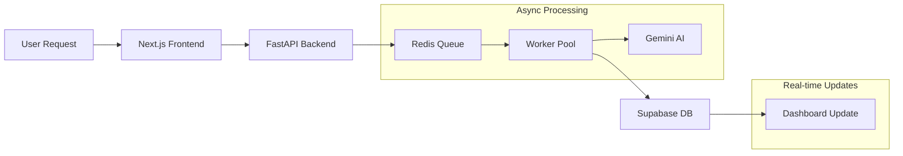
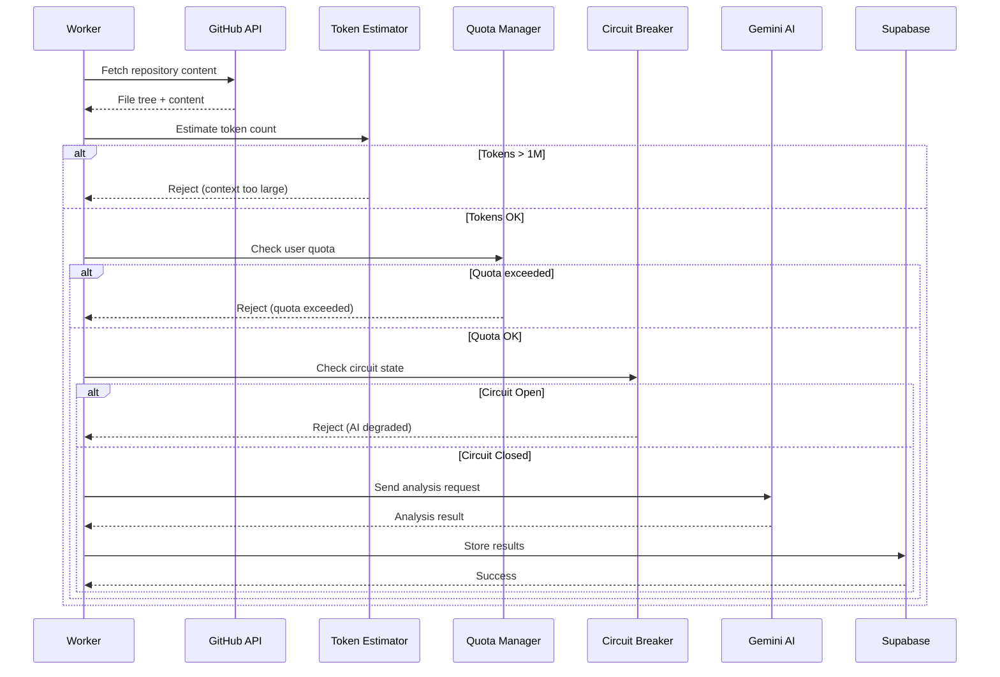

# System Overview

**AutoDevOps AI Platform**  
*A comprehensive guide for engineers joining the project*

---

## System Mission

The AutoDevOps AI Platform is a production-grade, multi-tenant SaaS system that automates repository analysis and CI/CD pipeline generation. It connects to GitHub repositories, analyzes codebases using AI (Gemini 1.5 Flash), and generates production-ready CI/CD configurations. The platform is designed for enterprise DevOps teams managing 50+ repositories who need to eliminate configuration drift, reduce analysis latency, and consolidate fragmented tooling.

**Core Value Proposition:**
- Reduce DevOps cycle time by 40% through automated CI/CD generation
- Maintain best-practice compliance across all repositories
- Provide AI-powered code analysis with actionable recommendations

---

## Core Components

| Component | Technology | Purpose | Port |
|-----------|------------|---------|------|
| **Frontend** | Next.js 14 | Server-rendered UI with real-time updates | 3000 |
| **API** | FastAPI | Stateless REST API with OAuth2 | 8000 |
| **Workers** | BullMQ + TypeScript | Async job processing with retries | - |
| **Queue** | Redis | Job queue, caching, rate limiting | 6379 |
| **AI** | Gemini 1.5 Flash | Code analysis and CI generation | - |
| **Database** | Supabase (PostgreSQL) | Multi-tenant storage with RLS | 5432 |

### Component Responsibilities

**Frontend (Next.js 14)**
- User authentication flow (GitHub OAuth)
- Repository connection dashboard
- Real-time analysis status via Supabase Realtime
- CI/CD configuration preview and deployment

**API (FastAPI)**
- OAuth2 session management
- Repository webhooks handling
- Job enqueue operations
- Rate limiting and input validation

**Workers (BullMQ)**
- Repository content fetching
- AI analysis processing
- CI/CD configuration generation
- Result storage and notifications

**Database (Supabase)**
- User and organization data
- Repository metadata
- Analysis results storage
- Encrypted OAuth tokens

---

## Request Lifecycle



### Detailed Flow

1. **User initiates analysis** from dashboard
2. **Frontend** calls `/api/repositories/{id}/analyze`
3. **API** validates session, creates job record, enqueues task
4. **API returns** 202 Accepted immediately
5. **Worker** picks up job from Redis queue
6. **Worker** fetches repository content via GitHub API
7. **Worker** sends content to Gemini AI for analysis
8. **AI** returns structured analysis and recommendations
9. **Worker** stores results in Supabase
10. **Frontend** receives real-time update via Supabase Realtime
11. **User** views analysis results and generated CI/CD config

---

## AI Processing Flow



### AI Resilience Layers

| Layer | Component | Purpose |
|-------|-----------|---------|
| 1 | Token Estimator | Pre-validate context fits model window (1M tokens) |
| 2 | Quota Manager | Per-user daily limits, org-level caps |
| 3 | Circuit Breaker | Fail-fast on provider degradation (5 failures → open) |
| 4 | Retry Logic | Exponential backoff with jitter (3 retries max) |

---

## Deployment Topology

```
┌─────────────────────────────────────────────────────────────────┐
│                      PRODUCTION ENVIRONMENT                      │
├─────────────────────────────────────────────────────────────────┤
│                                                                  │
│  ┌────────────────────────────────────────────────────────────┐ │
│  │                    VERCEL (Frontend)                        │ │
│  │  ┌──────────────────────────────────────────────────────┐  │ │
│  │  │  Next.js 14 (App Router)                              │  │ │
│  │  │  - Server Components                                  │  │ │
│  │  │  - Edge Functions for auth                           │  │ │
│  │  │  - Automatic HTTPS                                    │  │ │
│  │  └──────────────────────────────────────────────────────┘  │ │
│  └────────────────────────────────────────────────────────────┘ │
│                              │                                   │
│                              ▼                                   │
│  ┌────────────────────────────────────────────────────────────┐ │
│  │                    RAILWAY (Backend)                        │ │
│  │                                                             │ │
│  │  ┌─────────────┐  ┌─────────────┐  ┌─────────────┐        │ │
│  │  │ autodevops  │  │ autodevops  │  │ autodevops  │        │ │
│  │  │    -api     │  │   -worker   │  │    -cron    │        │ │
│  │  │ (1-3 replicas)│ │ (1-5 replicas)│ │ (singleton)│        │ │
│  │  │   :8000     │  │   :8001     │  │   :8002     │        │ │
│  │  └──────┬──────┘  └──────┬──────┘  └─────────────┘        │ │
│  │         │                │                                  │ │
│  │         ▼                ▼                                  │ │
│  │  ┌──────────────────────────────────────────────────────┐  │ │
│  │  │              Redis (Managed Plugin)                   │  │ │
│  │  │  - Queue management (BullMQ)                          │  │ │
│  │  │  - Rate limiting                                      │  │ │
│  │  │  - Caching                                            │  │ │
│  │  └──────────────────────────────────────────────────────┘  │ │
│  └────────────────────────────────────────────────────────────┘ │
│                              │                                   │
│                              ▼                                   │
│  ┌────────────────────────────────────────────────────────────┐ │
│  │                  SUPABASE (Data Layer)                      │ │
│  │  ┌──────────────────────────────────────────────────────┐  │ │
│  │  │  PostgreSQL with Row-Level Security                   │  │ │
│  │  │  - Multi-tenant data isolation                        │  │ │
│  │  │  - Realtime subscriptions                             │  │ │
│  │  │  - Automated backups                                  │  │ │
│  │  └──────────────────────────────────────────────────────┘  │ │
│  └────────────────────────────────────────────────────────────┘ │
│                                                                  │
└─────────────────────────────────────────────────────────────────┘
```

### Service Configuration

| Service | Replicas | Scaling Trigger | Health Check |
|---------|----------|-----------------|--------------|
| API | 1-3 | CPU > 70% | `/health` |
| Worker | 1-5 | Queue depth > 100 | Heartbeat |
| Cron | 1 | N/A | `/health` |

---

## Reliability Model

### Failure Modes and Mitigations

| Failure | Detection | Mitigation | Recovery Time |
|---------|-----------|------------|---------------|
| Database connection | Health check `/ready` | Connection pool retry | 5-30s |
| Redis unavailable | Queue ping | Graceful degradation | 10-60s |
| AI provider down | Circuit breaker | Automatic retry + fallback | 30s-5min |
| Worker crash | Heartbeat timeout | Job re-queued | 30s |
| GitHub API rate limit | HTTP 403 response | Exponential backoff | 1-60min |

### Circuit Breaker Configuration

```python
# app/ai/router.py
class CircuitBreaker:
    FAILURE_THRESHOLD = 5      # Open after 5 failures
    RECOVERY_TIMEOUT = 60      # Try half-open after 60s
    SUCCESS_THRESHOLD = 2      # Close after 2 successes
```

### Retry Strategy

| Attempt | Delay | Max Duration |
|---------|-------|--------------|
| 1 | Immediate | 5 min |
| 2 | 30s | 5 min |
| 3 | 2 min | 5 min |
| 4+ | Dead Letter Queue | - |

---

## Scaling Path (1k → 10k users)

### Current Architecture (1k users)

| Component | Capacity | Utilization |
|-----------|----------|-------------|
| API | 3 replicas | ~30% CPU |
| Workers | 5 replicas | ~40% CPU |
| Redis | 256MB | ~20% memory |
| Supabase | Pro tier | ~10% connections |

### Growth Milestones

**Milestone 1: 2,500 users**
- Add API replicas (3 → 5)
- Increase worker pool (5 → 8)
- Upgrade Redis to 512MB
- Implement request caching

**Milestone 2: 5,000 users**
- Add read replica for Supabase
- Implement AI response caching
- Add priority queue for premium users
- Consider CDN for static assets

**Milestone 3: 10,000 users**
- Migrate to dedicated Redis cluster
- Implement multi-region deployment
- Add AI model fallback (Claude, GPT-4)
- Consider sharding for hot tables

### Scaling Decision Matrix

| Metric | Current | Threshold | Action |
|--------|---------|-----------|--------|
| API CPU | 30% | > 70% | Add replica |
| Queue Depth | 10-50 | > 100 | Add workers |
| AI Latency P99 | 15s | > 30s | Enable caching |
| DB Connections | 20 | > 80 | Connection pooler |
| Error Rate | 0.1% | > 1% | Alert + investigate |

### Cost Projection

| Users | Monthly Cost | Primary Driver |
|-------|--------------|----------------|
| 1,000 | ~$200 | AI tokens |
| 5,000 | ~$600 | AI tokens + compute |
| 10,000 | ~$1,200 | All factors |

---

## Related Documentation

| Document | Purpose |
|----------|---------|
| [staff-overview.md](./staff-overview.md) | Staff-engineer system narrative |
| [architecture.md](./architecture.md) | Detailed architecture diagrams |
| [engineering_principles.md](./engineering_principles.md) | Core engineering principles |
| [observability.md](./observability.md) | Monitoring and SLOs |
| [branch_strategy.md](./branch_strategy.md) | Trunk-based workflow |

---

*Document Owner: Aditya Tiwari*  
*Last Updated: 2026-02-20*  
*Review Cycle: Quarterly*